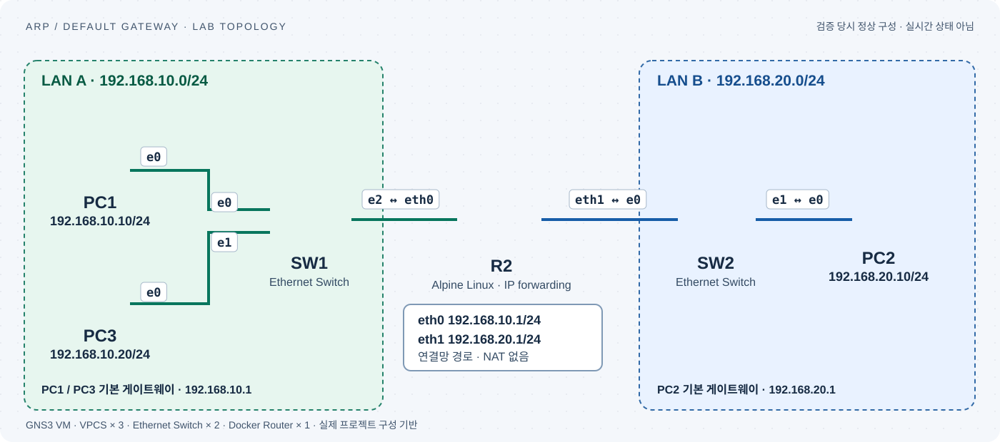

# ARP / Default Gateway — 구성 및 검증 결과

2026-09-13, GNS3 2.2.61 / GNS3 VM에서 실제 실행했다. **정상·장애·복구·재시작 9개 시나리오가 모두 통과했고, 27개 PCAP의 패킷 검증도 통과했다.** 기존 `01-Basic-ARP-ICMP` 프로젝트는 수정하지 않았다.

## 열기

- GNS3 프로젝트 이름: `02-ARP-Default-Gateway`.
- 다른 설치 환경으로 가져오기: `02-ARP-Default-Gateway.gns3project`를 GNS3에서 Import portable project로 가져온다. 압축 무결성과 VPCS 3대의 startup 파일 포함을 확인했다. 다른 PC에서의 실제 가져오기는 아직 검증하지 않았다.
- Docker 이미지 자체는 내보내기 파일에 포함하지 않았다. 대상 GNS3 서버에서 아래 공식 Alpine 이미지를 받을 수 있어야 한다.

## 구성



| 장비 | 주소 | 게이트웨이 |
|---|---|---|
| PC1 | 192.168.10.10/24 | 192.168.10.1 |
| PC3 | 192.168.10.20/24 | 192.168.10.1 |
| R2 eth0 | 192.168.10.1/24 | 연결망 경로 사용 |
| R2 eth1 | 192.168.20.1/24 | 연결망 경로 사용 |
| PC2 | 192.168.20.10/24 | 192.168.20.1 |

R2는 Alpine Linux의 IP forwarding을 사용하는 라우터다. SW1/SW2는 GNS3 기본 Ethernet Switch이며, 모든 노드는 GNS3 VM에서 실행한다. Lab에는 Cloud/NAT 노드나 실제 네트워크 연결을 추가하지 않았다. R2에는 두 연결망 경로만 있고 NAT를 구성하지 않았다.

이미지: `alpine:3.23`, 실제 노드에는 다음 digest를 고정했다.

`alpine@sha256:fd791d74b68913cbb027c6546007b3f0d3bc45125f797758156952bc2d6daf40`

R2 시작 명령에 인터페이스 주소와 forwarding 설정을 저장했고, VPCS 3대는 정상 IP 설정을 `save`로 저장했다. 노드 stop/start 후에도 별도 재설정 없이 통신 성공을 확인했다. 전체 Windows 재부팅 검증은 이번에 수행하지 않았다.

## 검증 결과

| 번호 / 폴더 | 변경·실험 | 실제 결과 |
|---|---|---|
| 01-same-subnet | PC1 → PC3 | ping 3/3, PC3 IP에 ARP |
| 02-routed | PC1 → PC2 | ping 3/3, 게이트웨이에 ARP |
| 03-wrong-gateway | PC1 GW를 192.168.10.254로 변경 | PC2 실패, PC3 3/3 성공 |
| 04-gateway-recovered | GW를 192.168.10.1로 복구 | PC2 3/3 성공 |
| 05-wrong-mask | PC1 마스크를 /16으로 변경 | PC2 실패, PC3 3/3 성공 |
| 06-mask-recovered | 마스크를 /24로 복구 | PC2 3/3 성공 |
| 07-gateway-down | R2 eth0 down | PC2 실패, PC3 3/3 성공 |
| 08-interface-recovered | R2 eth0 up | PC2 3/3 성공 |
| 09-restart-persistence | 전체 Lab 노드 stop/start | PC2 3/3 성공 |

추가로 PC2 → PC1 역방향 ping 3/3 성공을 확인했다(`reverse-ping.txt`). 실패 시나리오는 단순히 응답 수가 0이라는 이유만으로 판정하지 않고, 실제 ARP 대상과 응답 부재 및 라우터 반대편으로 대상 ICMP 요청이 전달되지 않음을 PCAP으로 확인했다.

## 패킷으로 확인한 핵심

정상 라우팅 시 같은 ICMP 식별자·순번을 가진 요청 3개를 라우터 양쪽에서 비교했다.

| 필드 | 라우터 통과 전 | 통과 후 |
|---|---|---|
| Source IP | 192.168.10.10 | 192.168.10.10 |
| Destination IP | 192.168.20.10 | 192.168.20.10 |
| Source MAC | 00:50:79:66:68:00 (PC1) | 02:42:d4:39:68:01 (R2 eth1) |
| Destination MAC | 02:42:d4:39:68:00 (R2 eth0) | 00:50:79:66:68:02 (PC2) |
| TTL | 64 | 63 |

**다른 대역으로 보낼 때 목적지 IP가 게이트웨이 IP로 바뀌지 않았다.** PC1은 다음 전달 대상인 게이트웨이의 MAC을 알아내 Ethernet 프레임을 보냈고, 라우터는 반대편 링크에 맞춰 MAC 헤더를 새로 만들었다.

장애별 차이:

- 잘못된 GW: PC1이 `192.168.10.254`를 ARP로 찾았지만 응답이 없었다.
- 잘못된 /16 마스크: PC1이 PC2를 같은 대역으로 판단해 `192.168.20.10`을 직접 ARP로 찾았다. R2의 proxy ARP는 꺼져 있어 응답이 없었다.
- 게이트웨이 eth0 down: 올바른 `192.168.10.1`을 ARP로 찾았지만 응답이 없었다.
- 세 장애 모두 PC3와의 같은 대역 통신은 계속 성공했다.

매 시나리오 시작 전에 PC들의 ARP 캐시와 R2 neighbor 캐시를 비웠다. 따라서 게이트웨이 down 실험은 **캐시가 비어 있는 조건**이다. 캐시가 남아 있는 즉시 장애 상황에서는 기존 MAC으로 ICMP를 먼저 전송할 수 있으므로 이번 관찰을 모든 상황에 일반화하지 않는다.

## 증거 읽기

각 번호 폴더에는 `console.txt`와 세 지점의 PCAP/CSV가 있다.

- `pc1-sw1.pcap`: PC1에서 나가는 프레임
- `sw1-r1.pcap`: 왼쪽 스위치와 실제 R2 사이
- `r1-sw2.pcap`: 실제 R2의 오른쪽 링크

파일명의 r1은 캡처 지점 식별자이며, GNS3에 표시되는 실제 라우터 이름은 R2다.

처음 볼 파일은 `02-routed/pc1-sw1.pcap`과 `02-routed/r1-sw2.pcap`이다. Wireshark 필터 `arp || icmp`로 비교하면 된다.

`packet-validation.json`은 패킷 수와 라우터 양쪽 비교 결과, `results.json`은 시나리오 결과다. 실패 시나리오 캡처에도 ICMP 요청/응답 각 3개가 있는데, 이는 함께 실행한 **PC3 정상 통신**이다. PC2 장애가 성공으로 바뀐 것이 아니다. IP 목적지를 함께 확인해야 한다.

`verify-packets.py`는 저장 PCAP의 핵심 조건을 다시 검사한다. 현재 Windows에 설치된 TShark가 필요하다. 장비에 접속하거나 Lab 설정을 바꾸지 않는다.

## 직접 재현할 명령

PC1 정상 설정:

```text
ip 192.168.10.10/24 192.168.10.1
clear arp
ping 192.168.20.10 -c 3
show arp
show ip
```

게이트웨이 오류는 첫 명령의 GW를 `192.168.10.254`로, 마스크 오류는 `/24`를 `/16`으로 바꾼다. IP 변경 시 중복 주소 검사가 끝나고 콘솔 프롬프트가 돌아온 뒤 다음 명령을 입력한다. 복구 후 정상 설정에서 `save`한다.

R2 장애/복구:

```sh
ip link set eth0 down
ip link set eth0 up
ip addr
ip route
ip neigh
```

## 범위와 후속 학습

기본 스위치는 관리형 스위치 CLI가 없으므로 `show mac-address-table`, VLAN/Trunk, STP 검증은 이번 결과에 포함하지 않았다. 라우팅 프로토콜도 사용하지 않았다. 다음 Ethernet/MAC Table 또는 Campus 랩에서는 관찰 가능한 스위치 종류를 먼저 정해야 한다.

이번 결과는 대행 구성·실행·패킷 분석 증거다. 사용자 핵심 답변 4개의 설명 확인을 마쳤다. 보완 내용은 explanation-note.md에 기록했다. 로드맵에 완료 주제 1개와 설명 노트 1개로 기록했다.

검증 과정에서 최초 자동화가 VPCS의 IP 중복 검사 완료 전에 다음 명령을 전송하는 문제가 발견되었다. 프롬프트 복귀를 기다리도록 수정하고 모든 시나리오를 다시 수행했다. 이 폴더의 결과는 수정 후 검증이며, 초기 시도는 작업용 폴더에 분리했다.

참고: [GNS3 공식 Docker 문서](https://docs.gns3.com/docs/emulators/docker-support-in-gns3), [기존 학습 계획](https://sebia1993.github.io/labs/arp-default-gateway.html).

최종 상태: 정상 설정 저장 후 Lab을 닫고 서버·VM을 종료했다. 검증 후 서버·VM이 종료된 것을 확인했다.

## 본인 설명 확인 완료

사용자 핵심 답변에 적용 조건과 진단 한계를 보완했다. 설명 노트: [explanation-note.md](explanation-note.md). 로드맵에는 완료 주제 1개·설명 노트 1개로 반영했다.
